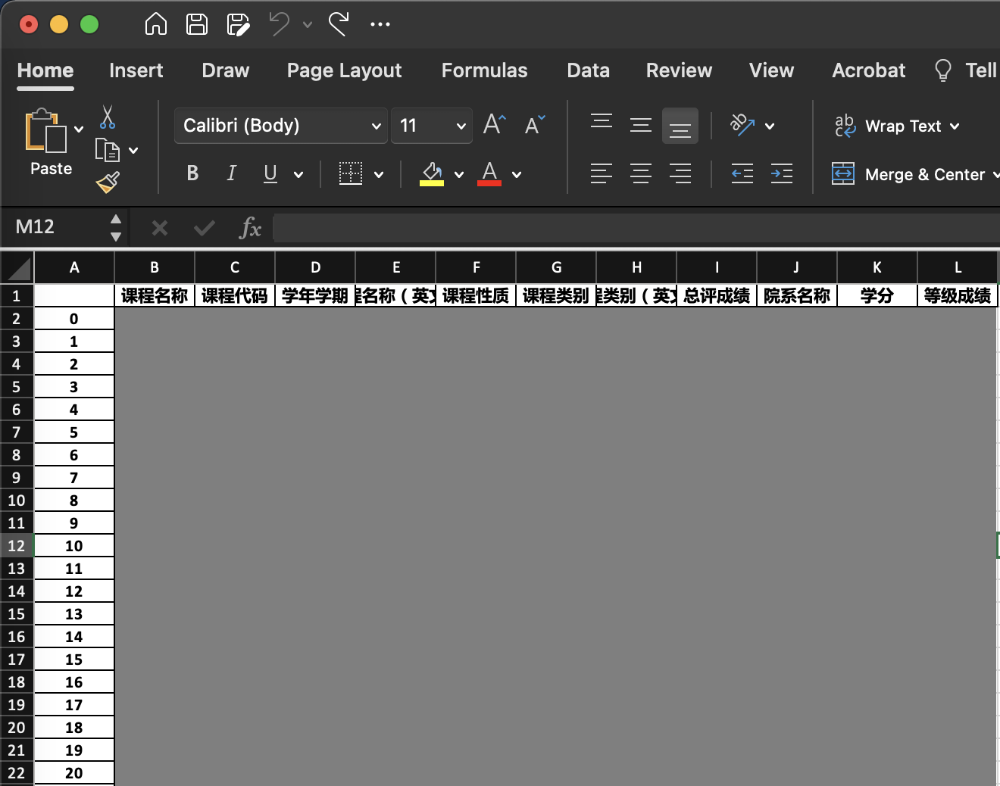

# sustech-tis-converter

本转换脚本用于将sustech教务系统中所有考试成绩导出为excel表格

# 导出表格样例


# 使用案例
1. 计算专业GPA：在导出的excel中筛选出所需要的专业课，利用excel公式进行计算
2. 不用打开笨重的tis查询成绩

# 使用说明
1. 创建conda虚拟环境
```shell
$ conda env create -n sustech-tis python==3.8
```
2. 激活环境
```shell
$ conda activate sustech-tis
```
3. 安装requirements
```shell
$ pip install -r requirements.txt
```
4. 运行脚本
```shell
$ python main.py  
```

# 致谢
感谢 @[GhostFrankWu](https://github.com/GhostFrankWu) 提供的cas认证function

# LICENSE
MIT LICENSE
